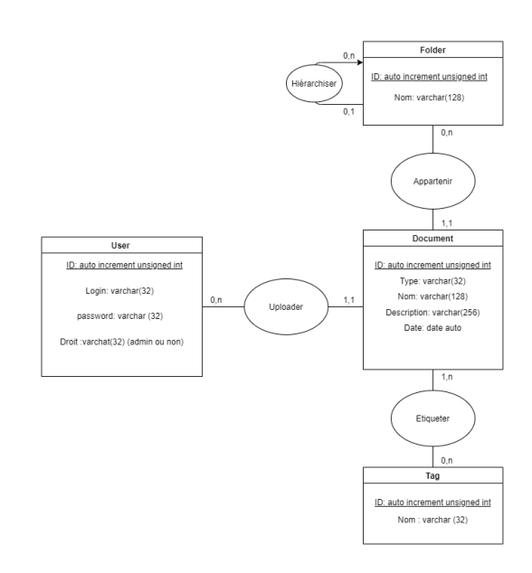

# ZeroPaper
Application web d'archivage

*Bouchakour, Bienfait, Le Corff, Poidvin, Sergent*

## Introduction
Dans le cadre du cours d'*Introduction aux systèmes d'information* et de *Développement Web* nous avons décidé, en accord avec les professeurs, de réaliser un projet en commun entre les deux cours, possédant des aspects qui permettent une évaluation dans ces derniers.

Nous nous tournons donc vers un sujet proposé par M. Djerroud.

## Sujet
Dans le cadre d’un projet Zéro Papier, l’EFREI souhaite développer une application
d’archivage documents. L’application doit permettre de sauvegarder des documents
divers en PDF, Image,… dans une base de données.

Des méta-données doivent être ajoutées pour chaque document afin de l’identifier
avec précision par exemple (Type, Nom document, description, date ...). Pour faciliter
la recherche.

Les documents sont classés par type, l’utilisateur doit pouvoir créer des types au
besoin.

L’application doit implémenter les fonctionnalités suivantes :
1. Authentification
2. Gestion des utilisateurs (Création, modification et suppression)
3. Statistiques : Nombre de documents par type etc.
4. Fonction de recherche
5. Impression

---

**NB** : nous avons décider de garder le sujet tel quel sans y ajouter de compléxité ou de profondeur supplémentaire afin de nous concentrer sur d'autres aspect de la gestion du projet:
- Gestion des versions / repo **GitHub** propre
- Mise en place pipeline **CI/CD** automatisé dans GitHub
- Gestion de projet avec les outils adéquats
- Déploiement dans des conteneurs **Docker**

## Répartition des tâches
- Front : Erwann
- Back & intégration : Hugo & PL
- Tests : Meo & PL
- CI/CD : Younes

## Technologies
### Front
Pas de technologies particulières retenues, développement classique avec HTML, CSS, JS, utilisation de Bootstrap (ou autre librairie CSS).

### Back
Développement en Python en utilisant le framework **[Django](https://www.djangoproject.com/)**, de part l'expérience d'un membre sur la techno et l'envie pour les autres de se former dessus. Permettra un développement plutôt rapide et formateur.

*PS : le framework fonctionne de la même manière que Symfony sur le principe.*

Base de données à définir mais certainement Postgresql.

### Tests
Utilisation de **[unittest](https://docs.python.org/3/library/unittest.html)**, inclu dans la librairie standard de Python.

### CI/CD & deploiement
Utilisation de **Docker** pour conteneuriser l'application afin de faciliter son déploiement et éviter les problèmes de dépendances.

Utilisation de **[GitHub action](https://github.com/features/actions)** permettant de réaliser des pipelines de déploiement. Le but étant de valider les tests pour ensuite lancer le déploiement de l'image Docker sur le serveur (peut-être accompagné d'un outil facilitant cela)

Utilsation d'un Raspberry Pi ou bien d'un cloud provider comme serveur pour le déploiement.

Utilisation de **[Caddy2](https://caddyserver.com/v2)** pour utiliser un chiffrage TLS et un DNS (nom de domaine).

### Gestion du projet
Utilisation de **[Trello](https://trello.com/)** pour l'organisation des tâches.

Utilisation de **[GitHub](https://github.com/)** pour noter les bugs et les fonctionnalité à implémenter (*issues*).

## Détails techniques
### Utilisation GitHub

Nous utiliserons GitHub de la manière suivante.
- `master` : branche de production
- `dev` : branche de développement
- `feature/<feature name>` : une branche pour chaque nouvelle feature. Elles seront merge sur la branche `dev`.

Le workflow devrait se faire donc de la manière suivante.

Nouvelle fonctionnalité :

1. Développement d'une fonctionnalité sur une branche `feature/`
2. Ouverture d'une pull request (merge request) vers `dev`
3. Validation par les membres du projet, système de review permettant d'assurer la qualité du code **ET** pipeline de tests OK
4. Merge de la branche vers `dev`

Déploiement en production :
1. Ouverture d'une pull request (merge request) vers `master`
2. Validation par les membres du projet, intégrations nécessaires **ET** pipeline de déploiement OK
3. Merge de la branche vers `master`
4. Pipeline master assurant le déploiement sur le serveur

---

L'idée étant que la branche `dev` n'a pas forcément besoin d'être fonctionnelle, cependant la branche `master` devra l'être tout le temps.

### Déploiement
*Procédure susceptible de changer.*

Pour le déploiement nous devrons dans un premier temps construire une image Docker pour notre application web. Pour ensuite créer un docker-composer assez simple avec notre image de l'application web et une image de la database (directement pull du [docker-hub](https://hub.docker.com/_/postgres)).

Ensuite il faudra mettre en place une pipeline se déclanchant lors d'un merge vers `master`. Elle devra réaliser les étapes suivantes :

1. Connexion au serveur
2. `git pull` de la nouvelle version du projet sur `master`
3. `docker build` de l'image docker
4. Lancement du docker-compose (forcer le rebuild)
5. Nouvelle version prête !

*Posibilité d'utilisé un outil facilitant cela, par example [Capistrano](https://capistranorb.com/). Le choix sera laissé à Younes.*

## Cahier des charges fonctionnel (simplifié)
*Première version définissant les grandes lignes des fonctionnalités.*

### Ecrans

**Vues :**
1. **Authentification**

Page de login classique avant de pouvoir accéder au site.

2. **Profil**

Vue du profil affichant les informations de l'utilisateur, possibilité d'ajouter des fonctionnalités futures comme la liste des documents sauvegardé, l'historique d'ajout des documents, etc..

3. **Page d'accueil (avec recherche)**

Page d'accueil épurée expliquant brièvement le concept du site, avec un champ de recherche classique redirigeant vers l'écran 4.

4. **Recherche classique + arborescence (dossiers)**

Champ de recherche, possibilité de filtrer et/ou trier la recherche (type, tags, date). Les résultats seront affichés avec leurs chemins d'accès (example : `nature/ciel/sunset.png`). Possibilité de cliquer ensuite sur le doc pour accéder à la vue détaillée de ce dernier.

Avant l'affichage des résultats on affichera tous les fichiers/dossiers présent à la racine de l'application, dans lesquels on pourra naviguer affichant les fichiers/dossiers présent dans ces derniers (à la manière d'un explorateur de fichiers classique).

5. **Vue détaillée du document/fichier**

Affichage des informations du fichier, et aperçu si possible. Possibilité de télécharger et d'imprimer le fichier.

6. **Gestion des utilisateurs**

Pour les admins, page affichant la liste des utilisateurs, et champs de recherche si possible.

**CRUD :**

*Possibilité de créer, lire, modifier et supprimer les éléments suivants :*

- dossier (écran n°4)
- tag (écran n°4)
- utilisateur (pour admin dans l'écran n°6)
- document (écran n°4 et 5)

### Modèle de données
*Susceptible d'évoluer au cours du projet.*

Nous pourrons utiliser ce modèle pour implémenter la partie *"Model"* de l'application.